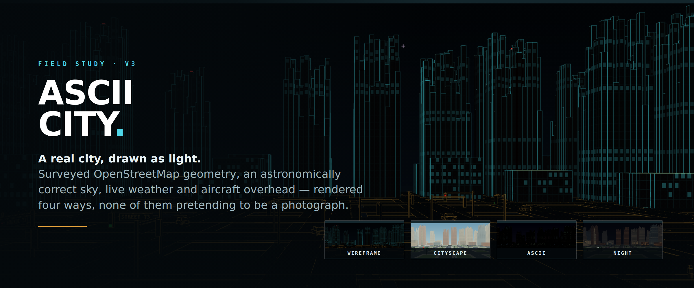

# ASCII City v3, Field Study



**A real city, drawn as light.**

Walk or fly a real place in your browser. The streets and buildings are
surveyed OpenStreetMap geometry, the sky is astronomically correct for that
location and hour, and the weather and aircraft overhead are live. None of it
pretends to be a photograph.

Four ways to see the same city:

| | |
| --- | --- |
| **Cityscape** | solid surfaces, sunlight, lit windows after dark |
| **Wireframe** | the geometry as glowing edges, in five colour schemes |
| **ASCII** | the character study this began as |
| **Pixel** | a half-block cinematic compositor |

Where the survey runs out, a generated substrate carries the city to the
horizon, scaled to the skyline of the place it surrounds, and every invented
cell is marked as such. In the wireframe view the frontier has its own colour:
you can stand on a roof and see where the map's knowledge ends.

This is a separate revision of [the original ASCII City](https://github.com/tweakyourpc/ascii-city)
and of [v2](https://github.com/tweakyourpc/ascii-city-2), with its own history
and repository.

## What is new

- A WebGL surface renderer with two looks: Cityscape, and a Wireframe view that
  outlines real faces rather than the triangulation behind them.
- Beyond the mapped extract, a generated substrate reaching the horizon, with its
  density and its skyline both taken from the extract it surrounds.
- Signals on mast arms over the carriageway, with lettered street-name blades,
  marked crossings and stop lines. What is drawn and what the traffic obeys come
  from the same constants and the same clock.
- Human-scale walking, separate walking and flying modes, and pedestrians that
  route the street network instead of pacing a raster axis.
- Cars follow a directed street graph, choose random routes, keep their lane,
  maintain headway, and brake for signals instead of bouncing between raster cells.
- Street signs face approaching traffic and name the cross street, not the street
  the viewer is already traveling on.
- Real cities use OpenStreetMap `highway=traffic_signals` nodes. Procedural cities
  use a repeatable subset of intersections. Opposing approaches have coordinated
  green, amber, and all-red clearance phases.
- Nearby internet radio comes from the open [Radio Browser](https://www.radio-browser.info/)
  directory, queried by position with a strict 150 km locality boundary, sorted
  nearest first, with saved station selection and tuning controls in the HUD.
- The city clock uses its real IANA time zone and daylight-saving rules. Time
  shifts become explicit simulations, while `NOW` returns to live conditions.
- Live ADS-B aircraft include nearest-contact bearing, distance, altitude, and
  turn guidance in the HUD, plus readable labels in the scene.
- Live earthquakes (USGS) mark recent seismic activity on the ground, colored by
  magnitude and recency, with a click-to-identify card.
- Live ALPR / "flock" camera map (DeFlock) shows license-plate readers near you
  as `▣` ground marks, colored by manufacturer (Flock amber, Motorola blue).
  The HUD gives the distance and compass point of the nearest one, so a single
  ground glyph behind a building is still findable. Click a mark to inspect its
  source coordinates.
- Weather, rain, snow, astronomy, buildings, labels, and aircraft remain available.

## Run locally

ASCII City uses conventional Node tooling and binds to the LAN. With no `PORT`
set, the operating system selects an available port and the server prints it:

```bash
npm install
npm start
```

`GET /whoami` reports the running service identity and selected port.

### Deployment Worker

The official GitHub Pages hostname uses its deployment-owned Worker. Clean
clones and alternate hostnames do not inherit that service and send no traffic
through the original author's account. Weather, OSM, geocoding, explicitly
tagged Wikipedia links, astronomy, local radio, and the procedural city all
work without a Worker. Live aircraft and live ALPR cameras need one, because
neither upstream sends CORS headers a browser will accept.

To enable those features, deploy the included Worker from your own Cloudflare
account and put its URL in `ascii-city.config.js`:

```bash
npm run worker:deploy
```

```js
export default Object.freeze({
  workerUrl: 'https://your-worker.example',
});
```

#### Choosing a Worker at runtime

`?worker=<url>` selects a Worker for the current browser and remembers it;
`?worker=` with no value forgets it. It is read from the query string or the
view hash. Nothing is inherited by a clone, because the value lives only in the
browser that set it:

```text
http://localhost:PORT/?worker=http://localhost:8787#city=demo
```

#### Live aircraft and where the Worker runs

The free ADS-B networks rate-limit or refuse Cloudflare's shared egress
addresses, so a Worker on `workers.dev` is commonly turned away: adsb.lol
answers `429`, adsb.fi answers `403`, and OpenSky drops the connection. The
Worker tries all three and reports which refused, rather than drawing an empty
sky. The same Worker reached over an ordinary connection is accepted, so live
aircraft work when it runs on your own address. Start it with the `worker:dev`
script, then open the page with `?worker=http://localhost:8787`.

Live cameras, radio, weather, and earthquakes are unaffected and work through
the deployed Worker.

## Walkable buildings (development milestone)

Load **Demo City (offline)** to start outside **Lantern Books**. Press **R** to
open the entrance and walk inside. Explore the furnished rooms, climb the stairs,
or use the elevator at the back right: enter the cabin, choose a floor in the HUD,
and press **GO**. The roof has a garden, furniture, and lookout seating. Windows
show the same rooms you can enter and the current city outside.

Suitable rectangular buildings in real and procedural cities also support entry.
Generated interiors and roof details are labeled **SIMULATED**. Use **SURFACE
BACKING** for a denser ASCII look and **EMPTY CITY** to pause and hide simulated
street life. Approach a bench from the front and press R to sit; R or movement
stands up again. Click objects to identify them.

See [interior controls, architecture, and current limits](docs/engine-next/INTERIORS.md).
Auto-tour, cyclists, and the remaining street-life improvements are later milestones.

## Controls

| Key | Action |
| --- | --- |
| `W` `A` `S` `D` / arrows | Move and turn |
| Drag | Look around |
| `E` / `Q` | Fly up / down |
| `V` | Switch walking / flying (walking descends to the ground or roof below) |
| `Shift` | Jog when walking; boost when flying |
| `R` | Interact with nearby doors, lifts, and seating |
| `N` | Toggle street signs |
| `B` | Cycle ASCII, block, and cinematic rendering |
| `L` | Cycle labels |
| `G` | Cycle traffic |
| `H` | Toggle traffic lights |
| `T` | Toggle live aircraft |
| `K` | Toggle live earthquakes |
| `F` | Toggle live ALPR cameras |
| `Y` | Toggle weather |
| `M` | Play/pause local radio |
| `,` / `.` | Previous / next station |
| `U` | Switch metric and imperial units |
| `P` | Toggle the frame-timing profile |
| `[` / `]` | Shift one hour |
| `0` | Return to the real current time at 1x |
| Click | Identify an object |
| `Esc` | Close the identify card |

The HUD is docked on the left by default so it does not cover the city. Use
`A−` / `A+` to resize it independently of browser zoom, `FLOAT` to overlay it,
or drag the `ASCII CITY` handle to place it anywhere. `QUALITY` cycles
all rendering modes between adaptive and fixed scales. The layout is saved
locally in the browser.

Walking starts at a 1.7 m eye height and 5.4 km/h, with smooth starts and stops.
`E` also enters flight directly; descending onto solid ground with `Q` returns
to walking. Airborne shared views retain their altitude and open in flight mode.

### Vehicle showcase controls

Traffic uses stable vehicle profiles and distance-based pseudo-volume in every
rendering mode. Developer-only seed, density, and forced-LOD controls are
documented in [docs/engine-next/VEHICLES.md](docs/engine-next/VEHICLES.md); they
do not add controls to the normal HUD.

## Architecture

The browser app is static and has no runtime package dependencies. An optional,
deployment-owned Cloudflare Worker in `worker/src/index.js` supplies CORS-safe,
allowlisted endpoints for nearby aircraft and radio discovery. It also implements
`GET /whoami`.

OpenStreetMap connectivity is based on shared node IDs. Geometric crossings at
different nodes, such as bridges and tunnels, are deliberately not connected.
One-way and access restrictions are preserved in the directed graph.

## Quality checks

```bash
npm run check
workspace-quality-gate
```

The test suite is hermetic. Network integrations use injected fixtures in tests.

## Data and licensing

- Map data: OpenStreetMap contributors, ODbL.
- Aircraft: adsb.lol (ODbL), adsb.fi, and the OpenSky Network, whichever the
  Worker can reach; coverage may be delayed or incomplete.
- Radio directory: Radio Browser; individual streams remain subject to their
  broadcasters' availability and terms.
- Earthquakes: USGS, public domain.
- ALPR cameras: DeFlock; data contributed by the DeFlock community under CC0.
- Weather: Open-Meteo.
- Source code: MIT, see [LICENSE](LICENSE).
